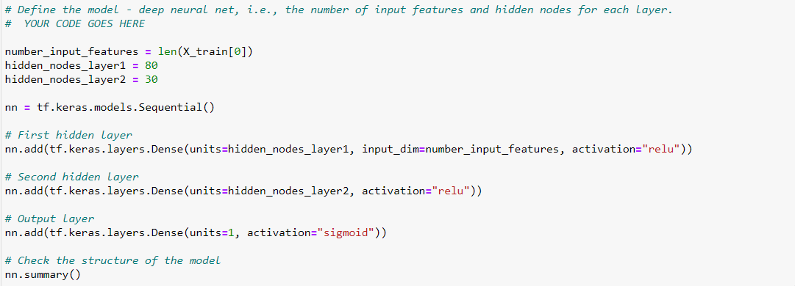
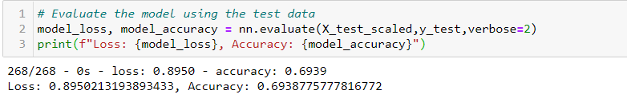
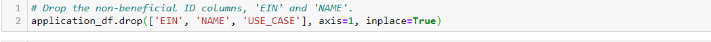
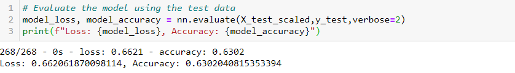
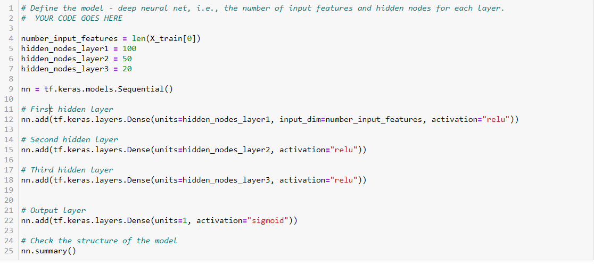
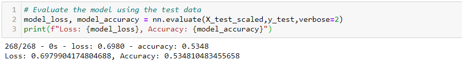
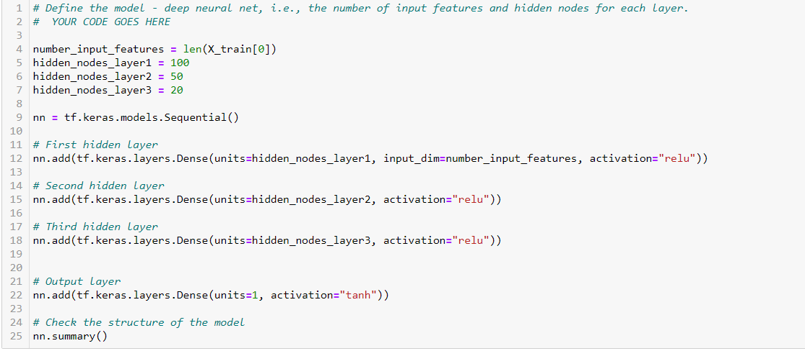
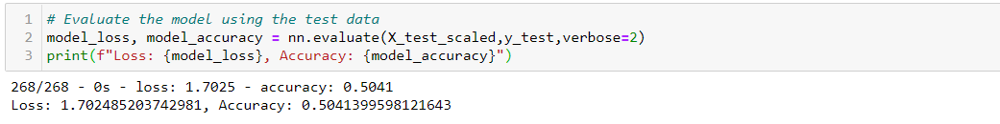

# Neural_Network_Charity_Analysis

## Overview of the Analysis 
For this project, I used Machine Learning and Neural Networks to create a binary classifier that will help predict whether the applicants who will be funded by a charitable organization called Alphabet Soup will be successful. We had a dataset with various measures on 34,000 Alphabet Soup-funded organizations for this analysis. This project consisted of the three steps listed below:
- Data preprocessing for the neural network
- Model Compilation, Training, and Evaluation 
- Model Optimization

## Results 

### Data Preprocessing 
- Variable that was considered as the target for my model: IS_SUCCESSFUL Column
- Variables that were considered features for my model: Every Column except for IS_SUCCESSFUL, which is our target and the ones we will drop
- Variable that was neither targets nor features for the dataset: Columns that I dropped are EIN, NAME because they will have little to no impact on our outcome

### Compiling, Training and Evaluating the Model

The number of neurons, layers, and activation functions I selected for my neural network model:
- For my neural network model, I had 2 hidden layers. My first layer had 80 neurons, the second had 30; there is also an output layer. The first and second hidden layers have the "ReLU" activation function, and the activation function for the output layer is "sigmoid."

Was the model able to achieve the target model performance?
- The model was not able to reach the target of 75%. The accuracy for my model was 69%.

The steps taken to try and increase model performance

**Attempt 1:** Removed additional feature, that is the 'USE_CASE' column. The rest of the model components stayed the same; however, model accuracy went down to 63%. 

**Attempt 2:** Adding Additional neurons to hidden layers and additional hidden layers. The accuracy went down again; this time, it was 53%.

**Attempt 3:** Changing activation function of output layer from "sigmoid" to "TanH." The accuracy of the model went down even more to 50%.

## Summary 

After optimization, the model achieved an accuracy score of 50%. However, the initial neural network had a 69% accuracy score. This decrease in accuracy can be attributed to the model being overfitted. Furthermore, we could improve the accuracy of our neural network by removing more features or simply adding more data to the dataset.

We could have used Random Forest classifiers instead of neural networks because our accuracy score was not exceptionally high. However, Random Forest is a robust and accurate model because of the sufficient number of estimators and tree depth. Furthermore, random forest models outperform neural networks and could have prevented overfitting the data.
